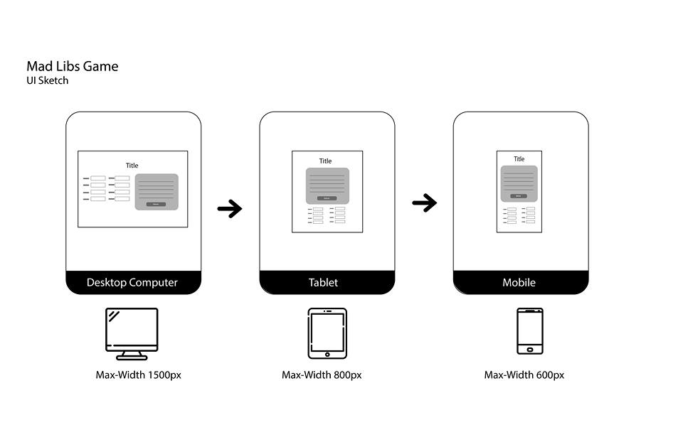

# Lab3

## Project Description
<!-- you can include known bugs, design decisions, external references used... -->
How to run (type this in the terminal): 
- ```cd lab3```
- ```npm run start```
- open the localhost url on your own browser 

### Component Structure
* ```Root```
  * ```MadFields``` (component contaning MadField components)
    * ```MadField``` (Input)
  * ```MadAnswers``` (component containing MadAnswer components)
    * ```MadAnswer``` (Subtitutions)
    * ```Refresh``` (Refresh Button)

### Features: 
- A button to refetch a random MadLib: get a new madlib and update the components.
- Create a functional MadLibs game that randomly chooses a MadLib when page loads. (Refresh the page should give you a different game)
- Use Vue components, choose whatever organization that makes most sense to you as long as your game logic is divided into reasonable components.
- As user inputs, the MadLib should be generated simultaneously.
- Filled subtitutions should be styled noticably different from unfilled substitutions.
- Separated each component into individual file

### Accessibility features:
- Color Contrast approved by WAVE 
- Focus indicator for buttons and input fields 
- Declare the language and document title
- Use a logical page hierarchy
- ARIA landmarks
- Bootstrap skip link
- Dynamic text sizing (?)
- Keyboard Only Navigation 

### Notes
- Uses a global EventBus for key-up events to change the blanks (source: https://alligator.io/vuejs/global-event-bus/)
- Uses created() on certain components to setup event-listening (https://vuejs.org/v2/api/#created)

### UI Sketch:
 